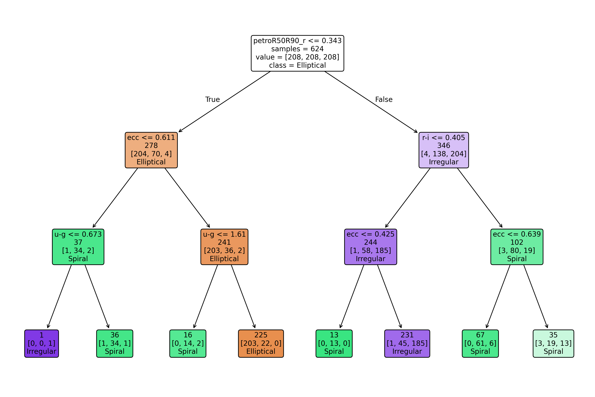
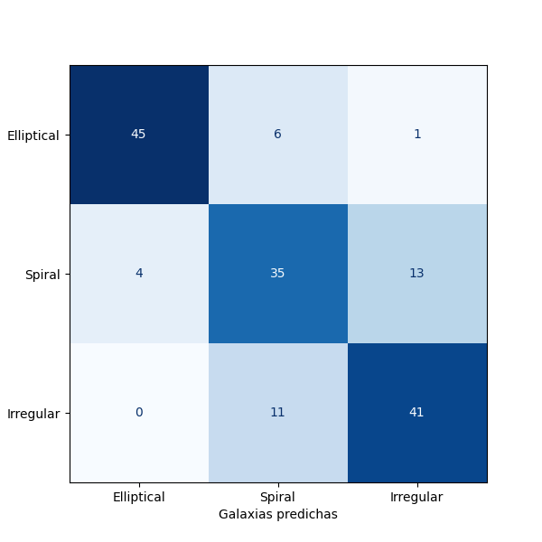
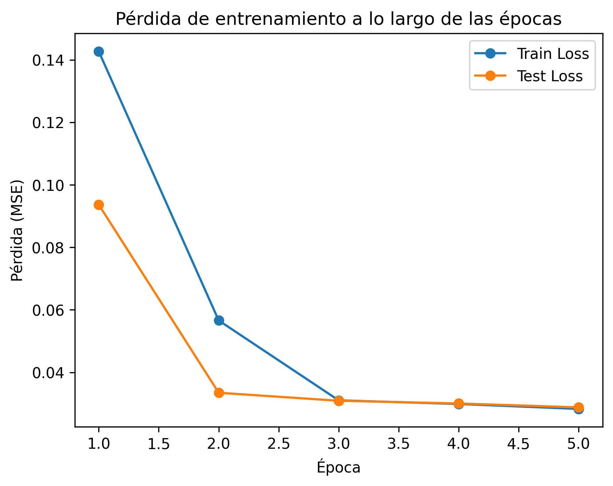

# Clasificador de Galaxias

El trabajo es desarollado en el marco de una actividad de Extensión-Educación por parte de la [Iniciativa de Datos e Inteligencia Artifical (IDIA)](https://idia.uchile.cl/) de la Universidad de Chile en conjunto con el Junior Achivement Chile para estudiantes de Media vocacional.

## Introducción
[Edwin Hubble (1936)](https://ui.adsabs.harvard.edu/abs/1936rene.book.....H/abstract) desarrollo un esquema de clasificacipon de galaxias basado en su morfología. En grandes rasgos se pueden classificar en Galaxías Elipticas (E), Galaxias Espirales (S) y Galaxias Irregulares (Irr), como se puede ver en la figura

    

[^1]. Con el objetivo más general de poder desarrollar un classificador más preciso surgió un proyecto de ciencia ciuddadana conocido como [Galaxy Zoo](https://www.zooniverse.org/projects/zookeeper/galaxy-zoo) ([Willett et al., 2013](https://ui.adsabs.harvard.edu/abs/2013MNRAS.435.2835W/abstract)) en el cual miles de voluntarios han venido clasificando imagenes de galaxias obtenidas por el Sloan Digital Sky Survey (SDSS) segun su morfología. De manera que podemos valernos de este dataset oara entrenar modelos de Deep Learning para la clasificación automática de galaxias.

## Objetivos 
- Aprender a usar diferentes herramientas de Aprendizaje de Maquina para afrontar problemas en el ambito de la Astronomía. 
- Desarrollar un clasificador de imagenes de galaxías usando un modelo sencillo de Arbol de Decisión (Decision Tree).
- Entrenar un modelo sencillo de Deep Learning para la regresión de imágenes de galaxias usando una Red Neuronal Convolucional (CNN), usando la arquitecture TinyVGG ([Simonyan & Zisserman, 2015](https://ui.adsabs.harvard.edu/abs/2014arXiv1409.1556S/abstract)).

## Metodología

Para el problema de clasificación de galaxias usaremos un modelo de Arbol de Decisión (Decision Tree). Este modelo es sencillo de interpretar y permite a los estudiantes entender cómo se toman las decisiones en función de las características extraídas de las imágenes. Usaremos características simples como la forma, el brillo y la textura de las galaxias para entrenar el modelo. El dataset será dividido en conjuntos de entrenamiento y prueba para evaluar el rendimiento del clasificador utilizando la matriz de confusión y la métrica de precisión.

Por otro lado para el problema de regresión de imágenes de galaxias, usamos un subset del dataset de Galaxy Zoo. En este caso entreremos un modelo de classificación de imanges basado en una red neuronal convolucional (CNN), basado en la arquitectura TinyVGG. Este modelo fue desarrollado por la Universidad de Oxford en 2015 para el tratamiento de imagenes ([Simonyan & Zisserman, 2015](https://ui.adsabs.harvard.edu/abs/2014arXiv1409.1556S/abstract)).

    

La loss function a utilizar será Mean Squared Error (MSE), adecuada para problemas de regresión. El optimizador seleccionado será Adam, conocido por su eficiencia y capacidad para manejar grandes conjuntos de datos y parámetros.

Cómo la idea es que los estudiantes puedan entender y modificar el código, se utilizará una arquitectura CNN sencilla con pocas capas convolucionales y de pooling, seguida de capas completamente conectadas. Esto permitirá a los estudiantes observar cómo cada componente contribuye al rendimiento del modelo sin abrumarlos con complejidades innecesarias. Se usará un notebook de Jupyter para facilitar la interacción y visualización de resultados durante el proceso de desarrollo y entrenamiento del modelo.

[^1]: Para nuestra actividad inicial las subclases de cada uno de estas clases se escapa más alla de lo que busca esta actividad introductoría del uso de Inteligencia Artifical aplicada a astronomía.

## Resultados

El arbol de decisión entrenado para la clasificación de galaxias se muestra en la siguiente figura

La matriz de confusión obtenida tras evaluar el modelo

Para el problema de regresion de imágenes de galaxias, para obtener las carectersticas más relevantes de cada imagen obtenida del subset de datos de Galaxy Zoo, se obtuvieron las siguientes curvas de pérdida durante el entrenamiento y validación del modelo:

## Referencias

- Hubble, E. P. (1936). The Realm of the Nebulae. Yale University Press.

- Simonyan, K., & Zisserman, A. (2015). Very deep convolutional networks for large-scale image recognition. arXiv. https://arxiv.org/abs/1409.1556

- Sreejith, S., Pereverzyev, S., Jr., Kelvin, L. S., Marleau, F. R., Haltmeier, M., Ebner, J., Bland-Hawthorn, J., Driver, S. P., Graham, A. W., Holwerda, B. W., Hopkins, A. M., Liske, J., Loveday, J., Moffett, A. J., Pimbblet, K. A., Taylor, E. N., Wang, L., & Wright, A. H. (2018). Galaxy And Mass Assembly: Automatic morphological classification of galaxies using statistical learning. Monthly Notices of the Royal Astronomical Society, 474(4), 5232–5258. https://doi.org/10.1093/mnras/stx2976

- Willett, K. W., Lintott, C. J., Bamford, S. P., Masters, K. L., Simmons, B. D., Casteels, K. R. V., Edmondson, E. M., Fortson, L. F., Kaviraj, S., Keel, W. C., Melvin, T., Nichol, R. C., Raddick, M. J., Schawinski, K., Simpson, R. J., Skibba, R. A., Smith, A. M., & Thomas, D. (2013). Galaxy Zoo 2: Detailed morphological classifications for 304 122 galaxies from the Sloan Digital Sky Survey. Monthly Notices of the Royal Astronomical Society, 435(4), 2835–2860. https://doi.org/10.1093/mnras/stt1458

## Autor
([@jurados](https://github.com/jurados)) Steve Jurado 

- Email: sjurado@das.uchile.cl

Fecha: 11/2025

